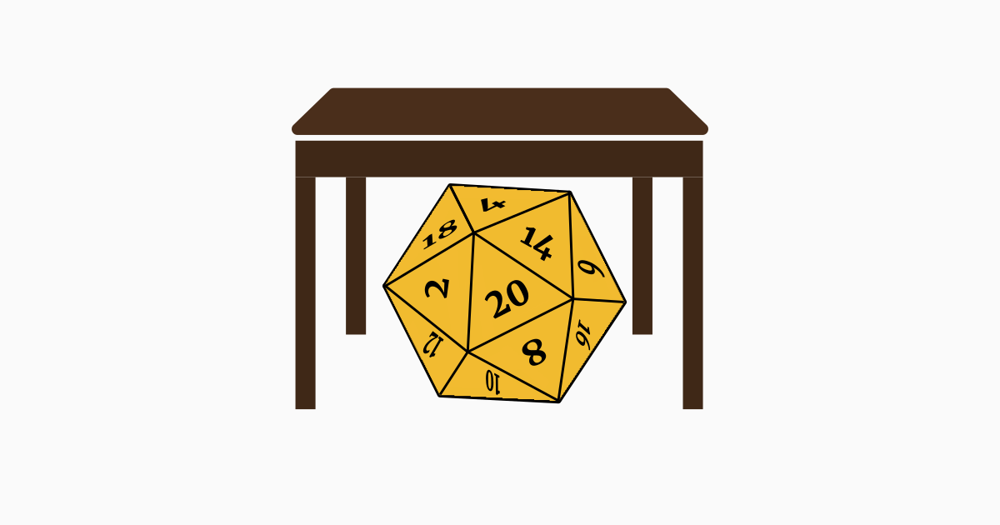

# DiceTable

[](LICENSE)
[](https://github.com/a1clark1a/diceTable/actions/workflows/ci.yml)
[](https://react.dev)
[](https://www.typescriptlang.org)

A focused dice probability tool for tabletop and strategy gaming. Build a single table of named dice rolls, see exact stats for each, and overlay every distribution on one chart to compare them at a glance.

**[Live demo: dice-table.app](https://dice-table.app/)**

<p align="center">
  
</p>

## What it is

- One flat table of named rolls. Each row is a dice expression with optional modifiers, keep / reroll / explode rules, and a roll mode (normal / advantage / disadvantage).
- Stat columns for mean, min, max, mode, standard deviation, and an optional Hit % against a target value.
- A comparison chart below the table that overlays every row's distribution (PMF, CDF, or CCDF) for direct visual comparison.
- Mobile-first card layout for screens under 720 px.
- All math is exact. Probabilities are computed by full convolution of dice distributions, not by Monte Carlo or normal approximations.

## Quick start

```bash
git clone https://github.com/a1clark1a/diceTable.git
cd diceTable
nvm use              # Node 24 (see .nvmrc); or install Node 24 another way
npm install
npm run dev          # http://localhost:5173
```

## Available scripts

```bash
npm run dev          # vite dev server
npm run build        # tsc -b && vite build (also catches type errors)
npm run test         # vitest run
npm run test:watch   # vitest in watch mode
npm run lint         # eslint
npm run verify       # lint + test + build in one go (matches CI)
npm run preview      # serve the production build locally
```

## Stack

- **React 19** + **TypeScript** (strict mode with `noUncheckedIndexedAccess` and `exactOptionalPropertyTypes`)
- **Vite** for dev and build
- **Chakra UI v3** for primitives and theming
- **Recharts** for the comparison chart
- **vitest** + **React Testing Library** for tests
- Pure-function probability engine in `src/engine/` (no UI imports)

## Project layout

```
src/
  engine/                 # pure probability math — no React, no Chakra, no recharts
    distribution.ts       # uniform, convolve, shift, normalise
    parts.ts              # single die + count, keep, reroll, explode
    expression.ts         # multi-part sum, modifier, roll-mode (adv/dis)
    stats.ts              # mean, variance, mode, cdf, ccdf, hitProbability, …
  state/
    AppContext.tsx        # the only stateful component; persists to localStorage v2
  hooks/
    useLocalStorage.ts    # versioned envelope persistence with optional migrator
  components/
    RollsTable.tsx        # desktop table view
    RollsCards.tsx        # mobile card view (≤ 720 px)
    RollExpand.tsx        # per-row editor (parts + roll mode)
    TargetToolbar.tsx     # target value + ruling, drives Hit % column
    chart/
      OverlayChart.tsx    # PMF/CDF/CCDF toggle, legend, all rows overlaid
      palette.ts          # 8-colour series palette + status colours
      format.ts           # number / percent formatting helpers
    editor/
      DicePartRow.tsx     # count, sides, keep/reroll/explode controls
      ExpressionRender.tsx # dice-text rendering with kh/kl tooltip tokens
    ui/                   # tooltip, help-term, color-mode (Chakra plumbing)
  types.ts                # all shared types
```

Deeper notes on specific subsystems live in [`docs/architecture/`](docs/architecture/): the [engine](docs/architecture/engine.md), [local-storage persistence](docs/architecture/local-storage.md), and [security headers](docs/architecture/security-headers.md).

## Data model

One flat `Expression[]`. No groups, no categories, no per-row "type" field.

```ts
type RollMode = "normal" | "advantage" | "disadvantage";

interface DicePart {
  id: string;
  count: number; // ≥ 1
  sides: number; // ≥ 2
  keep?: { type: "highest" | "lowest"; n: number };
  reroll?: { values: number[]; mode: "once" | "always" };
  explode?: { onFaces: number[]; depthCap: number };
}

interface Expression {
  id: string;
  name: string;
  parts: DicePart[]; // summed
  flatModifier: number;
  rollMode: RollMode;
}
```

Persisted shape (`localStorage` key `dicetable.v2`):

```ts
type ChartView = "pmf" | "cdf" | "ccdf" | "target";
type TargetRuling = "gte" | "gt" | "lte" | "lt" | "eq";

interface TargetState {
  values: number[]; // up to MAX_TARGETS (5)
  ruling: TargetRuling;
}

interface PersistedState {
  version: 2;
  expressions: Expression[];
  ui: {
    expandedId: string | null;
    chartView: ChartView;
    target: TargetState;
  };
}
```

The envelope is schema-validated on load via `validatePersistedState` (`src/state/persistedSchema.ts`); malformed entries fall back to the initial state instead of throwing.

## Privacy

DiceTable stores all your data (your rolls and settings) in your browser's `localStorage`, on your device. That data is never sent anywhere, and there is no account or login.

The hosted version at [dice-table.app](https://dice-table.app/) sends two kinds of anonymous operational data, neither of which includes your rolls or settings:

- **Vercel Analytics**: aggregate page-view metrics.
- **Crash reports**: when the app hits an unexpected error, it sends the error message, stack trace, the page path (with share-link data stripped), and a coarse browser name, capped per session, to help fix bugs.

## Contributing

Contributions are genuinely welcome, and small in-scope improvements are the easiest way in. The quickest place to start is a [good first issue](https://github.com/a1clark1a/diceTable/contribute).

The scope is deliberately lean, so a quick read of [CONTRIBUTING.md](CONTRIBUTING.md) before a non-trivial PR saves us both time. The short version:

- Typos, small bugfixes, and obvious cleanups: just send the PR.
- New features, refactors that touch the engine or state layer, new dependencies: open an issue first so we can talk through scope.
- Feature ideas are welcome. The app stays lean on purpose, so the requests most likely to land are the ones several people ask for. If a similar request already exists, add a 👍 instead of opening a duplicate: that demand is the signal I watch.

## Code of Conduct

This project follows the [Contributor Covenant v2.1](CODE_OF_CONDUCT.md). By participating you agree to abide by it.

## Security

Found a security issue? Please do not file a public issue. See [SECURITY.md](SECURITY.md) for the private reporting channel.

## License

[MIT](LICENSE) © a1clark1a
