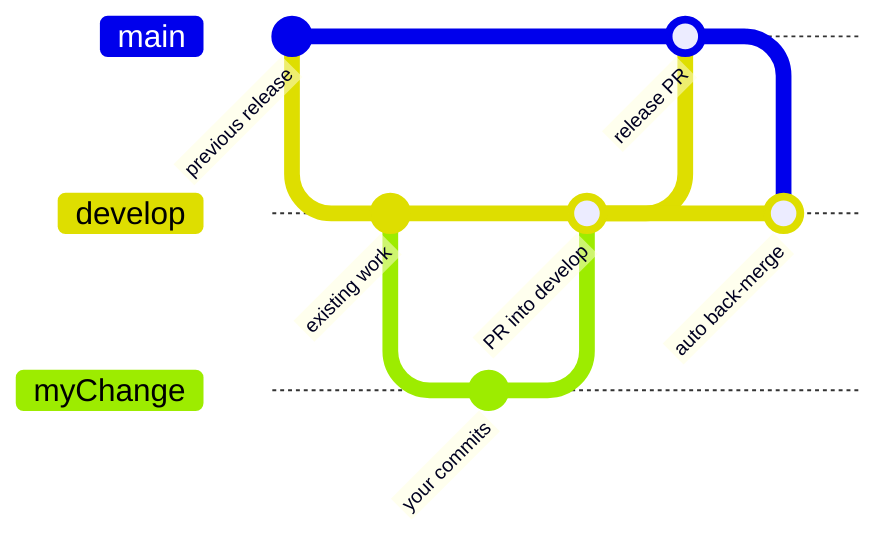
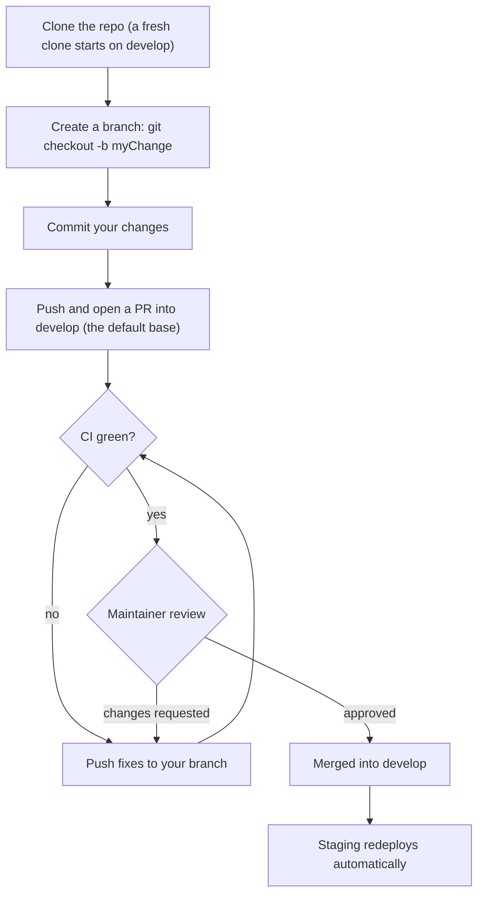
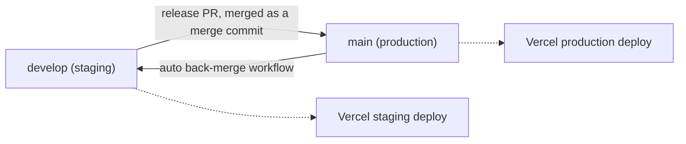

# Branching Model

> Status: Living doc, update when the branch flow or repo rules change.
> Last updated: 2026-07-18

DiceTable uses a two-branch model: `feature → develop (staging) → main (production)`. This doc is the visual walkthrough. The short version for contributors lives in [CONTRIBUTING.md](../../CONTRIBUTING.md#branching), and the deploy mechanics live in [ci-cd.md](ci-cd.md).

---

## The two branches

| Branch | Role | Deploys to | How code gets in |
|---|---|---|---|
| `develop` | Default branch. Integration branch where contributions land. | Staging | Contributor PRs |
| `main` | Production / release branch. | Production | Release PRs from `develop`, opened by the maintainer |

Both branches are protected. Nobody pushes to them directly, not even the maintainer. Everything moves by pull request.

## Life of a change

Reading top to bottom:

1. **Branch off `develop`.** It is the default branch, so a fresh clone already puts you in the right place.
2. **Open a PR into `develop`.** CI (lint, tests, type-check) runs on the PR. Once it is green and reviewed, the maintainer merges it and staging redeploys.
3. **The maintainer opens a release PR from `develop` into `main`.** Merging it triggers the production deploy.
4. **A workflow updates `develop` automatically.** After every merge to `main`, [backmerge.yml](../../.github/workflows/backmerge.yml) fast-forwards `develop` so the two branches never drift. No human has to remember this step.

## Contributor flow

If you accidentally open a PR against `main`, you don't need to close it. Edit the PR and change the base branch to `develop`.

## Release flow (maintainer)

Two rules keep this loop maintenance-free:

- **Release PRs merge as merge commits, never squash.** A merge commit keeps `develop`'s history inside `main`'s, so the back-merge is always a clean fast-forward. A squash would put a commit on `main` that `develop` has never seen, and the two histories would drift apart until they conflict.
- **The back-merge is automated.** The workflow runs on every push to `main`. In the normal flow it changes no files (right after a release, `main` and `develop` have identical content; only the merge commit itself is new). The push does re-run CI and the staging deploy on `develop`, which is redundant but harmless.

If a commit ever lands on `main` without going through `develop` (for example an emergency hotfix), the back-merge carries the real changes into `develop`. Should that merge conflict, the workflow run fails visibly and the maintainer resolves it with a manual PR from `main` into `develop`.
