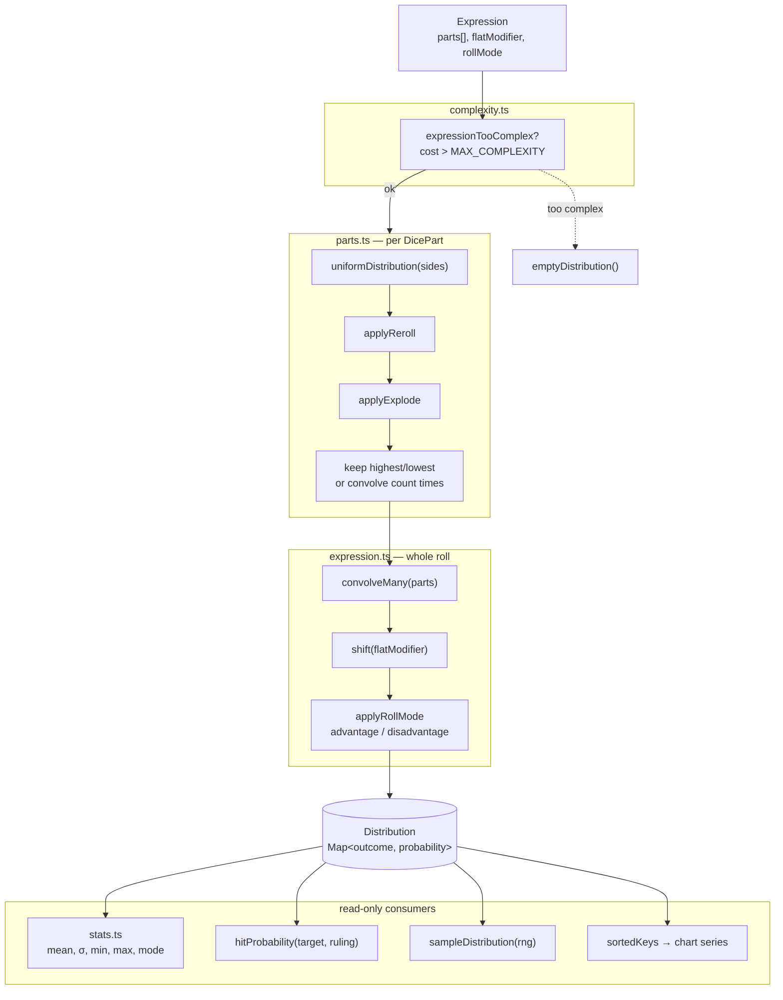

# Engine Architecture

> Status: Living doc. Update when the engine's public surface or math contract changes.
> Owner: Clark
> Last updated: 2026-06-06

This is the reference for how DiceTable turns a roll into numbers. `src/engine/**` is the math core: pure functions, no UI, no DOM. Read this before changing anything that touches `distribution.ts`, `parts.ts`, `expression.ts`, `stats.ts`, `complexity.ts`, or `sample.ts`, or before wiring a new consumer onto the engine from the React side.

It has two audiences, and two halves to match:

1. **App engineers** consuming the engine from the UI/state layer. The "What it is", "The Distribution contract", and "Public API" sections are the contract you build against.
2. **Anyone who wants to know how the numbers on screen are computed.** Jump to ["From a roll to the numbers"](#from-a-roll-to-the-numbers) for a plain-language walkthrough with no code.

---

## TL;DR

- **One data shape.** Everything the engine produces is a `Distribution`: a `Map<number, number>` from an outcome to its exact probability. The probabilities sum to 1.
- **One front door.** [`expressionDistribution(expr)`](../../src/engine/expression.ts) takes a user's `Expression` and returns its `Distribution`. Almost every consumer starts here.
- **Exact, never sampled.** Probabilities come from full enumeration and convolution. No normal approximation, no Monte Carlo. The numbers are the real numbers.
- **Empty means invalid.** Functions never throw on bad input. They return an empty `Map`. A consumer checks `dist.size === 0` (or the `hasDist` flag) and shows a fallback.
- **Pure and portable.** No imports from React, Chakra, recharts, or any UI module. The engine runs in tests with no DOM and could move to a worker or CLI unchanged.
- **Speed comes from bounds, not shortcuts.** A complexity score caps inputs before they blow up. Past the cap, compute returns empty rather than locking the tab.

---

## What this layer is

The pure math core that maps the user's authored dice (`Expression[]`) to probability distributions, and reads summary statistics off those distributions. It exists to:

1. Compute the **exact** probability of every possible total for any roll the UI can express.
2. Derive the numbers the table and chart show: mean, spread, min/max, most likely result, and the chance to clear a target.
3. Stay **portable**. Because it imports nothing from the UI, the same functions back the table, the chart, the inspect panel, the "Roll" button, and every test, without duplication.

## What this layer is NOT

These exclusions are intentional. Don't add them without a real product reason and a doc update.

- **Not a parser.** The engine consumes the already-structured `Expression` / `DicePart` objects from state. It does not parse `"4d6kh3 + 2"` from a string. Notation text is rendered by the UI, never round-tripped through the engine.
- **Not a sampler-first engine.** [`sampleDistribution`](../../src/engine/sample.ts) exists to draw one concrete roll for the "Roll" button, but it samples *from* the exact distribution. Statistics are never estimated by repeated sampling.
- **Not approximate.** No uniform or normal approximations, no central-limit shortcuts, no Monte Carlo. See the "Exactness" invariant below.
- **Not stateful.** No caches, no memo tables, no module-level mutable state inside `src/engine/**`. Caching is the consumer's job (see [`useDistributions`](../../src/state/useDistributions.ts)).
- **Not UI-aware.** No formatting, no rounding for display, no color, no React. The engine returns full-precision numbers; the UI decides how to show them.
- **Not a DSL.** No scripting, no `output`/`loop`, no expression language. One flat `Expression` describes one roll.
- **Not error-throwing.** Invalid input yields an empty distribution, not an exception. The whole layer fails closed and silent.

---

## Architecture overview

The engine is a one-directional pipeline. Data flows from the user's `Expression` down to a `Distribution`, and from there into stats, samples, and chart series. Nothing flows back up.



Key points:

- **`expressionDistribution` orchestrates the whole pipeline.** Consumers call it and get a finished `Distribution`. The per-part and per-primitive functions exist for it to call, and for tests.
- **Every stage returns a fresh `Map`.** Inputs are never mutated. `shift` returns a new map even for offset 0 (`new Map(dist)`). This keeps the pipeline safe to compose and safe to cache by input identity.
- **The complexity guard is the first gate.** It runs before any enumeration, so an over-large roll returns empty immediately instead of allocating a huge map.

---

## The Distribution contract

Everything hinges on one type, defined in [`types.ts`](../../src/types.ts):

```ts
export type Distribution = Map<number, number>;
```

A `Distribution` maps an **outcome** (an integer total the roll can produce) to its **probability** (a number in `(0, 1]`). The contract every engine function upholds:

| Property | Guarantee |
| --- | --- |
| **Keys** | Integer outcomes. Only outcomes with non-zero probability appear; impossible totals are absent, not stored as 0. |
| **Values** | Probabilities that sum to 1, within floating-point tolerance (`EPSILON = 1e-15`). |
| **Pruning** | Masses at or below `EPSILON` are dropped, so the map stays small and free of float dust. |
| **Empty = invalid** | A zero-size map (`emptyDistribution()`) is the single sentinel for "no valid result": bad input, a degenerate roll (e.g. reroll-always every face), or a roll past the complexity cap. |
| **Immutability** | Functions return new maps. They never mutate their arguments. |
| **Unordered** | A `Map` has insertion order, not sorted order. Use [`sortedKeys(dist)`](../../src/engine/distribution.ts) whenever order matters (rendering, percentiles, CDF). |

The **empty-map-as-error** convention is the most important thing to internalize. No engine function throws. Consumers branch on `dist.size === 0`. The state layer formalizes this with a `hasDist` boolean in [`rowStats.ts`](../../src/state/rowStats.ts) so the UI has one flag to check.

---

## Public API (consumer-facing)

This is the surface app code builds against. The engine exports more than this (every building block is exported for composition and tests), but a normal consumer only touches the front door.

### The front door

```ts
// The one call most consumers make. Expression in, Distribution out.
expressionDistribution(expr: Expression): Distribution

// Is this roll past the complexity cap? Cheap; runs no enumeration.
expressionTooComplex(expr: Expression): boolean
```

[`useDistributions`](../../src/state/useDistributions.ts) wraps exactly these two, caches the result per `Expression` identity, and hands the UI a `Map<id, Distribution>` plus a `Set<id>` of too-complex rows. If you are adding a consumer, prefer going through `useDistributions` rather than calling the engine directly.

### Reading statistics off a distribution

All of these take a `Distribution` and return plain numbers. From [`stats.ts`](../../src/engine/stats.ts):

```ts
mean(dist): number            // expected value, Σ outcome · p
variance(dist): number
stddev(dist): number          // how spread out the results are
min(dist): number             // lowest possible total
max(dist): number             // highest possible total
mode(dist): number[]          // most likely total(s); ties return all
percentile(dist, p): number   // smallest outcome whose CDF ≥ p

cdf(dist, k): number          // P(result ≤ k)
ccdf(dist, k): number         // P(result ≥ k)
probEqual(dist, k): number    // P(result = k)
probAtLeast(dist, k): number  // alias of ccdf
probAtMost(dist, k): number   // alias of cdf

hitProbability(dist, target, ruling): number
```

`hitProbability` is the one the table's "Hit %" column and the target chart use. `ruling` is a `TargetRuling` (`'gte' | 'gt' | 'lte' | 'lt' | 'eq'`) and selects which tail or point mass to sum. It returns 0 for an empty distribution or a non-finite target, so callers don't need to guard.

[`rowStats.ts`](../../src/state/rowStats.ts) bundles `mean / min / max / mode / stddev` into a `RowStats` object with the `hasDist` guard already applied. That is the recommended shape for table and card rows.

### Drawing a concrete roll

```ts
sampleDistribution(dist, rng = Math.random): number | null
```

Returns one outcome drawn in proportion to its probability, or `null` for an empty distribution. The `rng` parameter is injectable so tests can pass a deterministic generator. This is what backs the "Roll" button via [`RollHistoryContext`](../../src/state/RollHistoryContext.tsx). It is the only engine function that is non-deterministic by default, and it reads from the exact distribution rather than re-simulating dice.

### Exported building blocks

These are public for composition and heavily used in tests, but you rarely call them directly from app code. They are the internals `expressionDistribution` is assembled from:

| File | Functions |
| --- | --- |
| [`distribution.ts`](../../src/engine/distribution.ts) | `emptyDistribution`, `uniformDistribution`, `totalMass`, `normalise`, `shift`, `convolve`, `convolveMany`, `pruneSmall`, `sortedKeys` |
| [`parts.ts`](../../src/engine/parts.ts) | `applyReroll`, `applyExplode`, `singleDieDistribution`, `partDistribution` |
| [`expression.ts`](../../src/engine/expression.ts) | `applyRollMode`, `expressionDistribution` |
| [`complexity.ts`](../../src/engine/complexity.ts) | `partComplexity`, `expressionComplexity`, `partTooComplex`, `expressionTooComplex`, `MAX_COMPLEXITY`, `COMPLEXITY_OVERFLOW` |

`sortedKeys` is the one building block UI code legitimately reaches for outside the front door: the chart, sparkline, inspect table, and distribution table all need outcomes in ascending order. `applyKeep` is deliberately module-private to `parts.ts`; the public entry for keep-rules is `partDistribution`.

---

## How a roll is built (the pipeline)

`expressionDistribution` runs these stages in order. Each is a small, testable function.

1. **Guard.** If `parts` is empty or `expressionTooComplex(expr)`, return empty immediately. No enumeration happens for an over-budget roll.
2. **Per part → a single-die distribution** ([`singleDieDistribution`](../../src/engine/parts.ts)):
   - `uniformDistribution(sides)` gives the fair die: each face has probability `1/sides`.
   - `applyReroll` reshapes it if the part has a reroll rule (`once` vs `always`).
   - `applyExplode` adds the recursive "max face rolls again" mass, bounded by a depth cap.
3. **Per part → the part's total** ([`partDistribution`](../../src/engine/parts.ts)):
   - With a **keep** rule, enumerate the multiset of `count` dice and keep the highest/lowest `n` (combinatorial, hence the complexity cost).
   - Without keep, **convolve** the single die with itself `count` times (rolling `count` dice and summing).
4. **Combine parts** ([`convolveMany`](../../src/engine/distribution.ts)): convolve each part's distribution together, so `2d6 + 1d8` becomes the distribution of their sum.
5. **Apply the flat modifier** ([`shift`](../../src/engine/distribution.ts)): slide every outcome by `flatModifier`. A `+2` shifts the whole curve right by 2; it does not change its shape.
6. **Apply roll mode** ([`applyRollMode`](../../src/engine/expression.ts)): for advantage, the probability of landing at or below each outcome is squared (you take the better of two independent rolls); disadvantage squares the upper tail instead.

The result is the finished `Distribution` returned to the consumer. At every step, an empty intermediate short-circuits the rest and the whole call returns empty.

---

## Invariants

These are the load-bearing rules. They are enforced by code review and tests, not by the type system alone. Breaking one quietly breaks trust in the numbers.

### Purity

`src/engine/**` imports nothing from `react`, `@chakra-ui/*`, `recharts`, `next-themes`, `lucide-react`, or any other UI module. It depends only on `../types` and other engine files. This is what lets the math run in plain Vitest with no DOM, and what would let it move to a worker or a CLI without a rewrite. The engine is the asset of last resort: keep it portable.

### Exactness

Probabilities are computed by enumerating distributions and convolving them. There are no uniform or normal approximations and no Monte Carlo. Users compare numbers across rows and trust them; an approximation would silently break that. Speed is bought by bounding inputs (see complexity guards), never by giving up exactness.

### Immutability

Every function returns a new `Map`. None mutates its arguments. This is why `shift` returns `new Map(dist)` even when the offset is 0, and why consumers can safely cache a distribution by the identity of the `Expression` that produced it (the [`useDistributions`](../../src/state/useDistributions.ts) `WeakMap`). If a function ever mutated an input, that cache would return stale stats.

### Determinism

Given the same `Expression`, `expressionDistribution` always returns the same distribution. The single exception is `sampleDistribution`, which is random by design and accepts an injectable `rng` so it can be made deterministic in tests.

### Fail closed, fail silent

Bad input returns `emptyDistribution()`. The engine never throws and never logs. The consumer detects empty and renders a fallback. This keeps a malformed row from crashing the table mid-edit.

---

## Complexity guards

The exactness invariant has a cost: a roll like `100d20 keep highest 50` has an astronomically large outcome space. Rather than approximate (forbidden) or hang the tab, the engine refuses to compute past a budget.

[`complexity.ts`](../../src/engine/complexity.ts) assigns each part a cost:

- **Explode** costs `sides × depthCap`: each depth level re-convolves the exploding faces.
- **Keep** costs the number of distinct multisets of `count` dice over `sides` faces, `C(count + sides - 1, sides - 1)`, because keep-highest/lowest is enumerated combinatorially. This grows fast, so it dominates the budget.
- Plain dice (count + convolve) are effectively free here; the map stays narrow.

`expressionComplexity` sums the parts. If any part overflows (`COMPLEXITY_OVERFLOW`, a binomial too large to represent) or the total exceeds `MAX_COMPLEXITY = 1e5`, the roll is "too complex". `expressionDistribution` then returns empty, and the UI surfaces a "too complex to chart" state for that row (driven by the `tooComplex` set from [`useDistributions`](../../src/state/useDistributions.ts)).

The real ceiling, though, is the **UI input caps**, not this guard. The number inputs bound `count`, `sides`, and `keep n` to ranges that almost never reach `MAX_COMPLEXITY`. This guard is the backstop for a pasted/imported expression that slipped past those caps, so the engine still fails closed instead of locking up.

---

## From a roll to the numbers

This section is for anyone, technical or not, who wants to understand the numbers DiceTable shows. No code. If you want the worked-example version with formulas, the in-app **Docs → The Math** page (source: [`src/docs/math.tsx`](../../src/docs/math.tsx)) goes deeper. This is the short version of what happens under the hood.

**Start with one die.** A fair d6 has six faces, each equally likely. The engine writes that down literally: "1 with probability 1/6, 2 with probability 1/6, ..." That little table of outcome-to-chance is a *distribution*. It is the whole vocabulary of the tool.

**Add a second die by combining tables, not by rolling.** To find the chances for `2d6`, the engine pairs up every face of the first die with every face of the second, adds the two faces, and adds up the chances for each total. There are 36 equally likely pairs; six of them total 7, so a 7 has a 6-in-36 chance, while a 2 (only 1+1) has 1-in-36. This "combine two tables into the table of their sum" step is called convolution, and it is exact. The tool never simulates a single throw to get these odds. It counts every possibility once.

**A flat bonus just slides the table.** Adding `+3` does not change the *shape* of the curve, only its position. Every outcome moves up by three. The chance of each result stays the same; the labels shift.

**Keep, reroll, and explode reshape the table before combining.** Keeping the highest of several dice, rerolling 1s, or letting a maximum face "explode" into another roll each rewrite the per-die table to reflect the new odds. Then the same combine-and-sum machinery runs on top.

**Advantage and disadvantage are "best/worst of two".** With advantage, you roll twice and take the higher result, which pushes the odds toward bigger totals. The engine captures that by squaring the running "chance of landing at or below this value", which is exactly the math of taking the better of two independent rolls. Disadvantage does the mirror image.

**Everything on screen is read straight off the final table:**

- The **average** is each outcome weighted by its chance (the "expected" roll).
- The **spread** (the σ value) says how far results typically stray from that average. A wide, flat curve has a big spread; a tall, narrow one is consistent.
- The **most likely** result is simply the tallest bar.
- The **Hit %** for a target adds up the chances of every outcome that clears it. Set a target of 15 with a "≥" ruling and the tool sums the probability of every total of 15 or more.
- The **chart** is the same table drawn three ways: each bar's height (PMF), the running total from the bottom (CDF), or from the top (CCDF).

Because all of this comes from counting real possibilities rather than estimating, two rolls compared side by side are comparing true odds, not noisy samples. That is the whole point of the tool, and the reason the engine refuses to take approximation shortcuts.

---

## Guidelines for changes

### Adding a new statistic

Add a pure function to [`stats.ts`](../../src/engine/stats.ts) that takes a `Distribution` and returns a number (or array). Guard the empty case (return 0 / `[]`). If the UI needs it per-row, surface it through `RowStats` in [`rowStats.ts`](../../src/state/rowStats.ts) so the `hasDist` flag is applied in one place. Add a unit test in `stats.test.ts` covering the empty distribution and at least one known-value case.

### Adding a new dice mechanic

A new per-die rule (think "reroll", "explode") is a reshaping function in [`parts.ts`](../../src/engine/parts.ts) of the form `(Distribution, Rule) => Distribution`, slotted into `singleDieDistribution` in the right order. A new whole-roll transform (think "advantage") goes in [`expression.ts`](../../src/engine/expression.ts) and slots into `expressionDistribution`. Either way:

1. Define the rule's shape in [`types.ts`](../../src/types.ts) following the optional-field pattern on `DicePart`.
2. If the mechanic can balloon the outcome space, add its cost to [`complexity.ts`](../../src/engine/complexity.ts) in the same change. An unbounded mechanic with no complexity cost is a hang waiting to happen.
3. Persisted rules cross the storage boundary; extend the validator. See the [Local Storage doc](./local-storage.md).

### Keeping it pure

Do not import a UI module into `src/engine/**`. Do not add display formatting (rounding, percent signs, locale) inside the engine; return full-precision numbers and let the UI format. Do not add module-level mutable caches; caching is the consumer's concern.

### Performance

If recompute-on-every-keystroke ever becomes a real cost, the fix is at the **consumer** layer (the `WeakMap` cache in [`useDistributions`](../../src/state/useDistributions.ts), or moving compute to a worker), not by approximating inside the engine.

Measure in that order:

1. **A render-count assertion in vitest** is the reproducible gate. Prove that editing one row does not recompute every other row's distribution by counting renders or `expressionDistribution` calls. This runs in `npm run test`, is deterministic, and is immune to the dev-mode skew below.
2. **`npm run build && npm run preview`** for a real wall-clock feel. `vite preview` serves the minified `dist/` build, so the numbers are honest. Never profile the dev server: `<StrictMode>` (wired in [`main.tsx`](../../src/main.tsx)) double-invokes every render, and `vite build` minifies and tree-shakes in a way `vite dev` does not, so dev timings and bundle sizes are both misleading.

---

## Testing expectations

The engine is the most test-covered part of the app, and it should stay that way. Every file has a sibling `*.test.ts`.

- **Touching math, even slightly, requires `npm run test`.** A type-check (`npm run build`) is not enough; the contract here is numeric, not just structural.
- Cover the **empty distribution** path for any new function. It is the convention's escape hatch and the easiest case to forget.
- For statistics, assert against a **hand-computed known value** (e.g. the mean of a d6 is 3.5), not just internal consistency.
- For distributions, assert that **total mass is 1** within `EPSILON` after your transform, and that no key has zero/negative probability.
- For anything that can grow the outcome space, add a **complexity test** proving an over-budget input returns empty rather than hanging.

---

## Quick reference

| Concern | File |
| --- | --- |
| Distribution primitives (uniform, convolve, shift, normalise, sortedKeys) | [`src/engine/distribution.ts`](../../src/engine/distribution.ts) |
| Per-die mechanics (reroll, explode, keep) and per-part totals | [`src/engine/parts.ts`](../../src/engine/parts.ts) |
| Whole-roll assembly + roll modes (advantage/disadvantage) | [`src/engine/expression.ts`](../../src/engine/expression.ts) |
| Statistics (mean, σ, min/max, mode, cdf/ccdf, hitProbability, percentile) | [`src/engine/stats.ts`](../../src/engine/stats.ts) |
| Complexity budget and guards | [`src/engine/complexity.ts`](../../src/engine/complexity.ts) |
| Sampling one concrete roll | [`src/engine/sample.ts`](../../src/engine/sample.ts) |
| Engine-facing types (`Distribution`, `Expression`, `DicePart`, rules) | [`src/types.ts`](../../src/types.ts) |
| Consumer cache + selector | [`src/state/useDistributions.ts`](../../src/state/useDistributions.ts) |
| Per-row stats bundle (`hasDist` guard) | [`src/state/rowStats.ts`](../../src/state/rowStats.ts) |
| "Roll" button sampling | [`src/state/RollHistoryContext.tsx`](../../src/state/RollHistoryContext.tsx) |
| User-facing math walkthrough | [`src/docs/math.tsx`](../../src/docs/math.tsx) |
