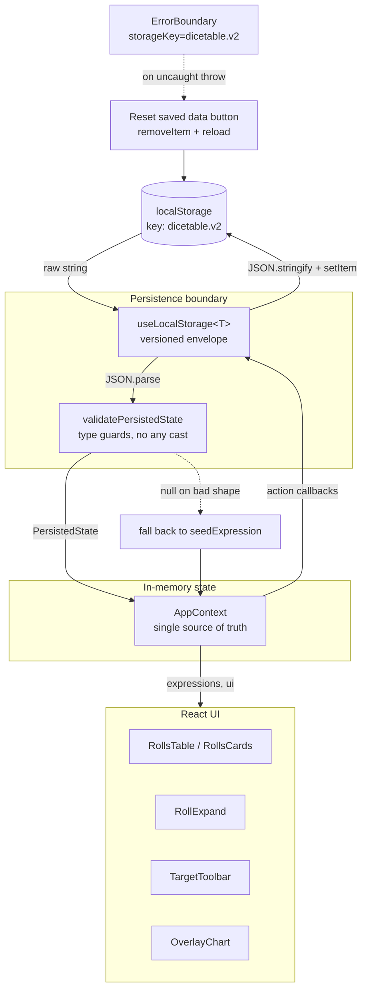

# Local Storage Architecture

> Status: Living doc — update when the persistence contract changes.
> Owner: Clark
> Last updated: 2026-05-07

This is the foundational reference for how DiceTable persists user data. Read this before changing anything that touches `localStorage`, `useLocalStorage`, `persistedSchema`, or the shape of `PersistedState`. Every persistence change is a compatibility decision — this doc exists so those decisions stay deliberate.

---

## TL;DR

- **One key.** All app state lives under a single `localStorage` key: `dicetable.v2`.
- **One envelope.** Stored as `{ version, value }`. The version bumps with breaking shape changes.
- **One validator.** [`validatePersistedState`](../../src/state/persistedSchema.ts) is the only trusted way data crosses the boundary back into the app.
- **One source of truth.** [`AppContext`](../../src/state/AppContext.tsx) is the single component that owns persisted state. Every other component reads from context, never from `localStorage` directly.
- **Serverless. Single-device. Client-only.** No accounts, no sync, no migration server, no IndexedDB, no service worker. By design.

---

## What this layer is

A thin, versioned, validated, debounce-free pass-through between an in-memory React state object and the browser's `localStorage`. It exists to:

1. Keep the user's rolls between sessions on the same device + browser.
2. Make the persisted shape **explicit** and **validated** — so a corrupt payload, a half-written write, or a stale schema can never silently produce a malformed runtime model.
3. Give a single place to bump versions, write migrators, and reason about backwards compatibility.

## What this layer is NOT

These exclusions are intentional. Don't add them without a real product reason and a doc update.

- **Not a database.** No queries, no indexes, no transactions. The whole state is read once, held in memory, and written back on every change.
- **Not a sync layer.** No multi-device sync, no conflict resolution, no CRDTs, no last-write-wins between tabs.
- **Not multi-tab safe.** Two tabs of DiceTable open at once will overwrite each other's writes. Not a current use case; flagged below.
- **Not encrypted.** Anyone with access to the browser profile can read it. Don't put secrets in here. Today's data (dice expressions) is non-sensitive — this is an explicit assumption, not an oversight.
- **Not migration-by-AI.** A version bump requires a hand-written migrator or an intentional reset. We do not "best-effort merge" old shapes.
- **Not IndexedDB.** Total state is small (kilobytes). Switching to IDB would buy capacity and async writes we do not need today.
- **Not a server-state cache.** There is no server. Don't introduce React Query / SWR-shaped patterns; they imply a remote source that does not exist.
- **Not a feature-flag store.** Persisted state is the user's data, not the app's configuration. Flags belong in build-time config or runtime URL params.
- **Not a logging sink.** Don't write debug breadcrumbs, error logs, or telemetry into `dicetable.v2`. Telemetry, if it ever lands, gets its own key and its own contract.
- **Not a session cache for derived values.** Distributions, stats, and chart data are recomputed from `expressions` on each render. Persisting them would mean keeping two sources of truth in sync — a bug factory.

---

## Architecture overview



Key points:
- **One direction in (read on mount), one direction out (write on every state change).** No bidirectional binding, no storage-event listeners.
- **The validator is the boundary.** After it returns, the rest of the app trusts the shape. No defensive `Array.isArray` / `typeof` checks downstream.
- **`ErrorBoundary` is the escape hatch.** If hydration succeeds but a downstream render throws because of unforeseen data, the user can wipe `dicetable.v2` from the fallback UI and reload.

---

## Current implementation

### The key

```
localStorage["dicetable.v2"]
```

The `.v2` is the **product version**, not the envelope version. It's the second iteration of DiceTable; the previous sidebar-based UX used a different shape under a different key and was deleted before launch. Keep this key stable across schema bumps; bump the **envelope `version` field** instead. Only rename the storage key on a deliberate UX-level reset (a "v3" that throws away v2 data).

### The envelope

Defined in [`useLocalStorage.ts`](../../src/hooks/useLocalStorage.ts):

```ts
interface Envelope<T> {
  version: number;
  value: T;
}
```

Every write wraps the current value in this envelope. Every read peels it back, checks the version, and runs the validator (or migrator) before handing the value to React.

### The hook

`useLocalStorage<T>(key, initialValue, { version, migrate?, validate? })`:

- **Read:** runs once on mount via `useState(read)`. Reads the raw string, `JSON.parse`s it, checks the envelope shape and version, runs `validate` if provided, and falls back to `initialValue` on any failure.
- **Write:** runs in a `useEffect` keyed on `[key, version, value]`. The very first effect run is skipped via an `isFirst` ref so we don't immediately rewrite the just-read value. Every subsequent state change writes a fresh envelope.
- **Throw safety:** read and write are both wrapped in `try/catch`. Quota errors and serialization failures are swallowed silently. This is intentional — we do not want a quota event to crash the editor mid-typing.

### The validator

[`validatePersistedState`](../../src/state/persistedSchema.ts) is a hand-rolled type guard suite. It returns a `PersistedState | null`. Behavior:

- Rejects if `version !== 2`.
- Rejects if any expression or part fails its shape check (non-string id, non-integer count, unknown `rollMode`, malformed `keep` / `reroll` / `explode`, etc.).
- **Forgives** missing or partial `ui` blobs by filling defaults — `ui` is a UX state cache, not data the user cares about preserving exactly. A wrong `chartView` falls back to `'pmf'`; a wrong `target.ruling` falls back to `'gte'`.

The split is deliberate: **`expressions` is data, `ui` is preference.** Data is rejected on any malformedness. Preferences are repaired silently.

No `zod` or other schema library — adding one would be ~12 kB of bundle for one validator, and the manual guards here are fully tested in [`persistedSchema.test.ts`](../../src/state/persistedSchema.test.ts).

### The persisted shape

```ts
interface PersistedState {
  version: 2;
  expressions: Expression[];
  ui: {
    expandedId: string | null;
    chartView: "pmf" | "cdf" | "ccdf" | "target";
    target: {
      value: number | null;
      ruling: "gte" | "gt" | "lte" | "lt" | "eq";
    };
  };
}
```

`Expression` and `DicePart` are defined in [`types.ts`](../../src/types.ts). Optional fields on parts (`keep`, `reroll`, `explode`) are persisted with the `'key' in patch` semantics — present means "set this", absent means "no rule". Don't persist `undefined`-valued keys; either include them with a value or omit them.

### The error boundary

[`ErrorBoundary`](../../src/components/ErrorBoundary.tsx) wraps `<AppProvider>` in [`App.tsx`](../../src/App.tsx) with `storageKey="dicetable.v2"`. On any uncaught render error it shows a recovery panel with a **Reset saved data** button that calls `localStorage.removeItem(key)` and reloads. This is the user-facing escape hatch when validation passes but a runtime invariant breaks.

---

## Lifecycle

### Boot

1. `App` renders; `Provider` (Chakra) and `ErrorBoundary` mount.
2. `AppProvider` calls `useLocalStorage('dicetable.v2', initialState, { version: 2, validate: validatePersistedState })`.
3. The hook reads the raw string. If empty / unparseable / wrong version / fails validation, returns `initialState` (a single seed `4d6kh3 + 2 (adv)` expression).
4. Initial state is held in React; the first effect-run skip prevents an immediate clobber-write.
5. Children render against `state.expressions` and `state.ui`.

### Edit

1. A child calls one of the action callbacks (`addExpression`, `updatePart`, `setTarget`, `setExpandedId`, …).
2. The callback uses the functional `setState` form to produce the next `PersistedState` immutably.
3. React re-renders. The `useEffect` in `useLocalStorage` fires because `value` changed.
4. The effect serializes the new envelope and writes it. Synchronously.

### Recovery

| Failure mode                        | What happens                                                                                                                 |
| ----------------------------------- | ---------------------------------------------------------------------------------------------------------------------------- |
| Storage empty (first visit)         | `read()` returns `initialState`; user sees the seed row.                                                                     |
| `JSON.parse` throws                 | Caught; `read()` returns `initialState`. User loses prior data. (Logged: nothing today — see "Caveats".)                     |
| Envelope `version` doesn't match    | Without a migrator, `read()` returns `initialState`. With a migrator, the migrator gets the raw parsed object and may upgrade it. |
| Validation fails                    | `read()` returns `initialState`. Same effect as a parse failure.                                                             |
| Render throws after validation      | `ErrorBoundary` catches it; user can click **Reset saved data** to clear and reload.                                         |
| `setItem` throws (quota / private)  | Swallowed; in-memory state stays correct for the session, persistence silently breaks. User data lost on tab close.          |
| Two tabs writing simultaneously     | Last write wins. Whichever tab persists most recently overwrites the other.                                                  |

---

## Versioning policy

The envelope `version` field is the contract between past and future shapes. The rules:

### Bump the version when

- A required field is added, removed, or renamed in `Expression`, `DicePart`, `KeepRule`, `RerollRule`, `ExplodeRule`, or `PersistedState` itself.
- A field's value semantics change (e.g. `flatModifier` switches from "additive" to "multiplicative").
- An enum loses a value that was previously valid.

### Don't bump the version when

- Adding an **optional** field with a sensible default (e.g. a new optional rule on `DicePart`). Old payloads simply omit it.
- Adding a value to an enum that the validator already rejects unknowns from — but **do** make sure old clients fail closed (validator rejects new value, falls back to default), and document the behavior.
- Changing only the `ui` block. The validator already repairs `ui`; old payloads pick up new UI defaults transparently.
- Changing the renderer or any computed/derived values — those aren't persisted.

### How to bump

1. Define the new shape in `types.ts`.
2. Bump `STATE_VERSION` in [`AppContext.tsx`](../../src/state/AppContext.tsx) and the literal type on `PersistedState['version']`.
3. Update `validatePersistedState` to require the new version and shape.
4. Add a `migrate(raw: unknown): PersistedState | null` function and pass it to `useLocalStorage` options. The migrator gets the **parsed but not envelope-validated** raw object; it must return a fully valid `PersistedState` of the new version, or `null` to fall back to `initialState`.
5. Add tests covering: a valid old-version payload upgrades correctly; a malformed old-version payload falls back; the new validator accepts the migrated shape.

### Migrator vs. reset

A migrator is the right tool when **most users** would lose meaningful work on a bump (their named rolls). A reset (no migrator, `read()` returns `initialState`) is fine for early-development bumps where active users are few and explicit.

---

## Guidelines for changes

### Adding a new field

- **If it's data** (something the user authored and would notice losing): add it to `types.ts`, extend `validatePersistedState` to enforce its shape, decide whether old payloads need a migrator (optional with default ⇒ no, required ⇒ yes), and update tests.
- **If it's UI preference** (chart toggle, expanded row, last-used target): add it to the `ui` block, give it a sensible default in `validateUi`. No version bump.
- **Never add it loose.** Don't write a sibling key to `localStorage`. The whole app state lives under one envelope; a second key creates a second migration timeline.

### Adding a new action

Add the callback to `AppContext.tsx` using the functional `setState` form. Don't read `localStorage` directly from a component; the hook is the only authorized reader, and `AppContext` is the only authorized owner.

### Reading the current value outside React

Don't. If you need the persisted state from a non-React context (e.g. a script, a debug tool, a future export feature), parse the envelope yourself and run the validator manually. The hook is React-scoped on purpose — it owns the in-memory copy and treats `localStorage` as backing store.

### Persisting a derived value

Don't. If a value can be recomputed from `expressions`, recompute it. The exception is **user preference about derived views** (e.g. "I last looked at the CDF") — that goes in `ui`, not in a parallel `derived` block.

### Storing user-uploaded content

Out of scope today. If it ever lands (e.g. import a roll set from JSON), the import path goes through the same validator before merging into state. The validator is the only trusted entry point — don't bypass it for "trusted" sources, because there is no such thing on the client.

---

## Caveats and known limits

These are documented compromises. Some have fixes pending; some are deliberate.

### Documented compromises

1. **No multi-tab coordination.** Open two tabs, edit both, last close wins. Acceptable today because the tool is single-user, single-task. If multi-tab becomes a real workflow, listen to `window.addEventListener('storage', …)` and merge or warn.
2. **Quota and private-mode write failures are silent.** A user in private mode may not realize their session won't survive a refresh. Acceptable for now; surface via a toast if reports come in.
3. **Parse / validation failures are silent at runtime.** The user just gets the seed row back with no banner explaining what happened. A pre-launch nice-to-have is a small "your saved rolls couldn't be read — is that ok?" notice with a one-click reset.
4. **No telemetry on hydration failures.** We don't know how often validation rejects. If we add error reporting (Sentry-shaped), the validator's null returns and the hook's caught exceptions are the first events to capture.
5. **`crypto.randomUUID` requires a secure context.** [`newId`](../../src/state/defaultPart.ts) falls back to `Math.random + Date.now`, which is fine because IDs are row keys, not security tokens. Don't change this without checking deployment context.
6. **Synchronous writes on every keystroke.** Each character typed into a name or modifier field triggers a `JSON.stringify` + `setItem` of the entire state. State is small (kilobytes) so this is invisible today. If state grows, debounce the write effect — don't switch storage backends.
7. **No schema for partial / streaming updates.** A write is always the whole envelope. There is no patch protocol, no journaling, no incremental flush. Don't introduce one without a measured need.
8. **`ui` repair masks a class of bugs.** If a future change accidentally writes an unknown `chartView`, the validator silently falls back to `'pmf'` and we never notice. This is the right tradeoff for user-facing resilience but should be remembered when debugging "why does my view keep resetting".

### Deliberate non-features

- No backup / export. (Could be added — JSON download of the envelope — without changing this layer.)
- No undo / redo. State is mutated in place via `setState`. Undo would be its own feature, layered above this contract.
- No diffing or patch encoding. Whole-envelope writes are simpler and bug-free.
- No `useSyncExternalStore` integration. The hook is a plain `useState + useEffect`. Adding `useSyncExternalStore` would matter only if we cared about cross-tab sync, which we don't.

---

## Testing expectations

When you change anything in this layer:

- Update or add tests in [`persistedSchema.test.ts`](../../src/state/persistedSchema.test.ts) for any shape change. Cover: valid payload, JSON round-trip, each rejection case, default-filling for `ui`.
- Update or add tests in [`useLocalStorage.test.ts`](../../src/hooks/useLocalStorage.test.ts) for any behavior change in the hook (versioning, migration, validation).
- Run `npm run test`. State persistence touches state and persistence; both are covered. Don't ship a change here on `npm run build` alone.

If you write a migrator, the migrator gets its own test file. The minimum cases:
- Valid old-version payload migrates to a valid new-version payload.
- Malformed old-version payload falls back (returns `null`).
- New-version payload (already migrated) passes through unchanged.

---

## Future extensions (intentionally deferred)

These are reasonable directions if a real need shows up. Not roadmap commitments. Each would require its own design pass and an update to this doc.

- **Export / import** as JSON. Round-trips through the validator on import. No schema change needed.
- **Named workspaces / saves.** Would require either multiple keys (one per workspace) or a `workspaces: Workspace[]` field in the envelope. Either is a real schema decision; don't backdoor it.
- **Cross-tab sync.** Storage-event listener + a small reconciliation strategy. Probably "reload from `localStorage` when the other tab writes" rather than CRDT-style merging.
- **Quota / private-mode UX.** A toast on `setItem` failure, gated by a session-level "already warned" flag.
- **Migration to IndexedDB.** Only worth it if state grows past hundreds of KB or async writes become a perf issue. Not the default.
- **Server-backed sync (accounts).** Largest scope change in the list — would replace this layer entirely, not extend it. Treat that as a v3 project, not a feature.

---

## Quick reference

| Concern                             | File                                                                              |
| ----------------------------------- | --------------------------------------------------------------------------------- |
| Storage key + state version         | [`src/state/AppContext.tsx`](../../src/state/AppContext.tsx)                      |
| Envelope read / write               | [`src/hooks/useLocalStorage.ts`](../../src/hooks/useLocalStorage.ts)              |
| Validation / type guards            | [`src/state/persistedSchema.ts`](../../src/state/persistedSchema.ts)              |
| Persisted shape                     | [`src/types.ts`](../../src/types.ts) (`PersistedState`, `Expression`, `DicePart`) |
| Seed data                           | [`src/state/AppContext.tsx`](../../src/state/AppContext.tsx) (`seedExpression`)   |
| ID generation                       | [`src/state/defaultPart.ts`](../../src/state/defaultPart.ts) (`newId`)            |
| Recovery UI                         | [`src/components/ErrorBoundary.tsx`](../../src/components/ErrorBoundary.tsx)      |
| Boundary wiring                     | [`src/App.tsx`](../../src/App.tsx)                                                |
